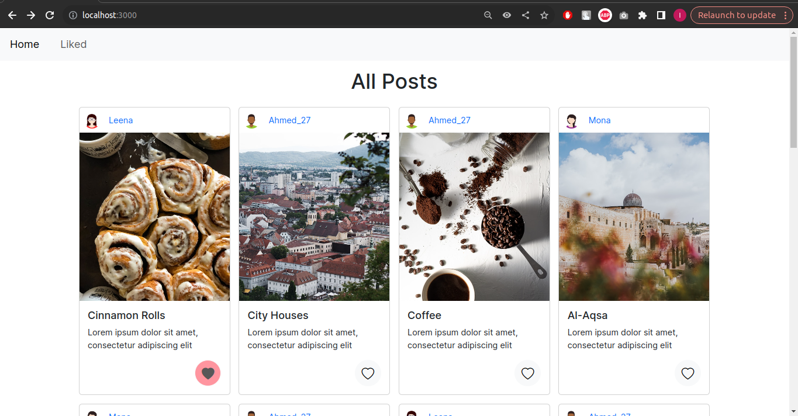
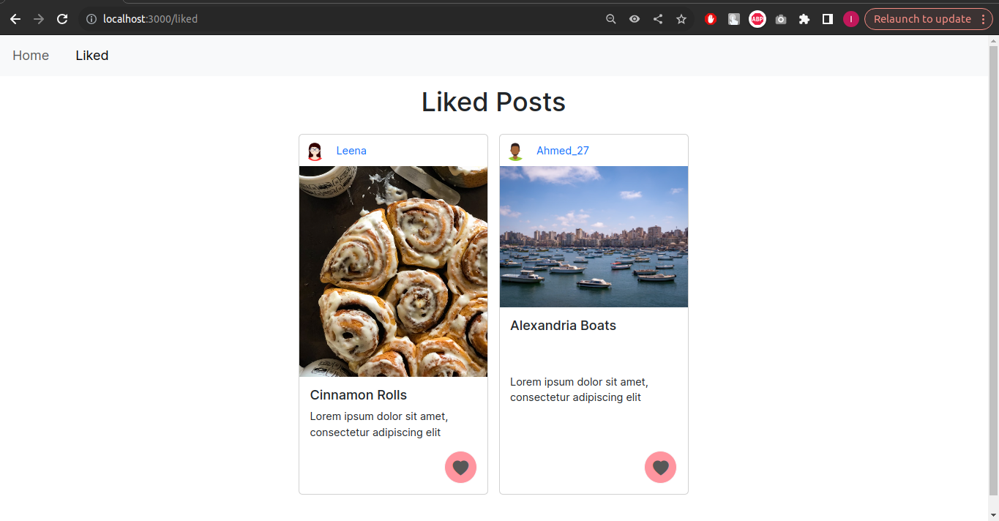
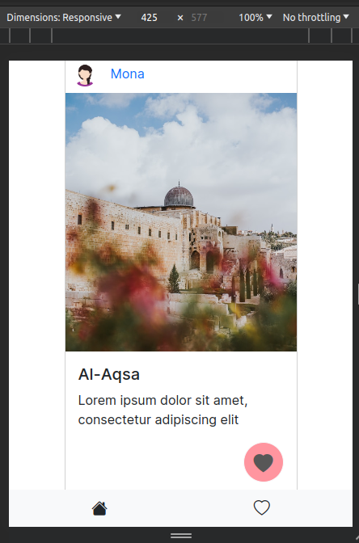

# Posts App
Scroll through the posts and mark your favourites, come back later to the "Liked" tab to view them again!

## Screenshots
### Home Page

### "Liked" Page


### Responsive Design (mobile screen)


## Getting Started

1. Clone project

2. install dependencies

```bash
cd path/to/posts-app
npm install
```
3. run the development server:

```bash
npm run dev
# or
yarn dev
# or
pnpm dev
# or
bun dev
```

Open [http://localhost:3000](http://localhost:3000) with your browser to see the result.

## Technologies
- This is a [Next.js](https://nextjs.org/) project bootstrapped with [`create-next-app`](https://github.com/vercel/next.js/tree/canary/packages/create-next-app).
- [Bootstrap](https://getbootstrap.com/) was used for styling.

## Features
- Like button 
<br> favourites are stored in browser local storage, and are displayed in the "Liked" tab.
- Responsive design
<br> Cards grid becomes a column, and navigation bar moves to bottom